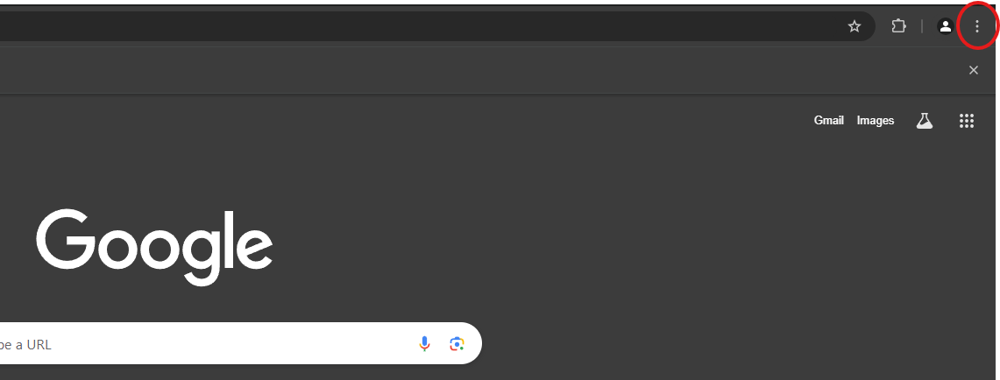
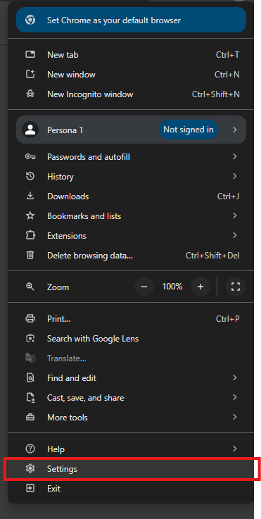
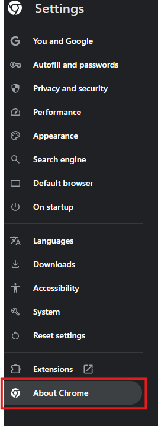
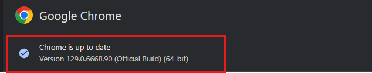

# <p align="center">Automated Cookie Game With Selenium</p>

# Install Selenium

- It is recommended to use a virtual environment:
### Create virtual environment
```
python -m venv environment_name
```

- Activate:
``Windows``: venv\Scripts\activate

``Mac/Linux``: venv/bin/activate

2) Download Selenium.
```
python -m pip install selenium
```

### Install your browser driver.

- On this opportunity I'm going to use Google Chrome

1) Check your Google Chrome's version.
    - Go to the browser settings
    - Click in <b>About Chrome</b>

 <br>
 <br>
 <br>
 <br>

2) Install the correct version of your browser driver <a href="https://googlechromelabs.github.io/chrome-for-testing/">here</a>

- If you want to, you can install the `chromedriver.exe` file and save it in the project folder.


# Acknowledgments

- This repository was possible thanks to <a href="https://www.youtube.com/@TechWithTim">Tech With Tim's Selenium Video</a>